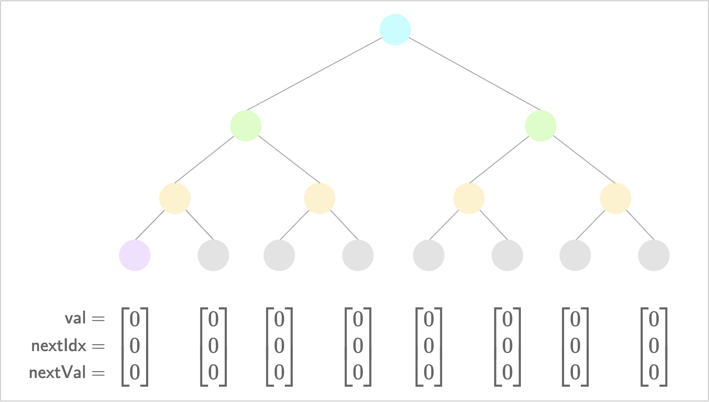
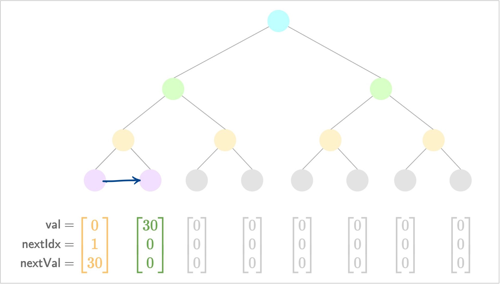
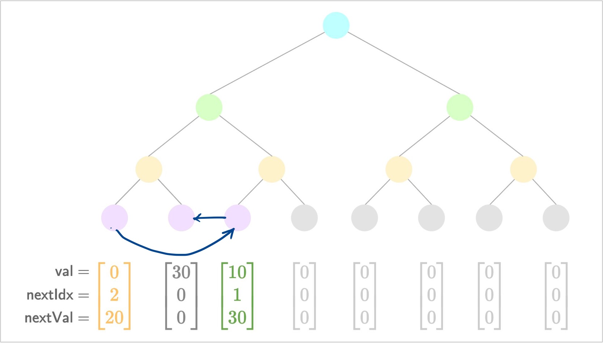
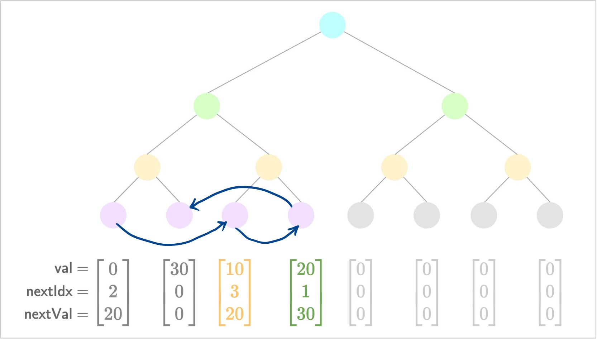
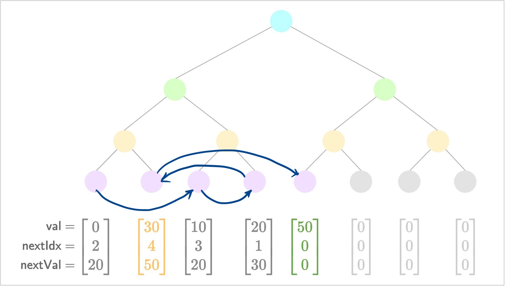

## Indexed Merkle Tree Test

Hi there! Welcome to this Indexed Merkle tree test that you are about to take. We will guide you through the concept of Indexed Merkle trees before you begin crushing this exercise.

#### Pre-requisites

We assume that you are familier with the concept of Merkle trees. If not, please read [this](https://decentralizedthoughts.github.io/2020-12-22-what-is-a-merkle-tree/) excellent blog.

#### Indexed Merkle Tree

An indexed Merkle tree is a variant of the basic Merkle tree where the leaf structure changes slightly. Each leaf in the indexed Merkle tree not only stores some value $v \in \mathbb{F}$ but also points to the leaf with the next higher value:

$$
\textsf{leaf} = \{v, i_{\textsf{next}}, v_{\textsf{next}}\}.
$$

where $i_{\textsf{next}}$ is the index of the leaf with the next higher value $v_{\textsf{next}} > v$. By design, we assume that there are no leaves in the tree with a value between the range $(v, v_{\textsf{next}})$. Let us look at a toy example of the state transitions in an indexed Merkle tree of depth 3.

[Note: Please check out [this](https://hackmd.io/@suyash67/ByXqvJI12) hackmd for the images, they're missing from the dependencies.]

1. Initial state
   
2. Add a new value $v=30$
   
3. Add a new value $v=10$
   
4. Add a new value $v=20$
   
5. Add a new value $v=50$
   

#### Exercise

In this exercise, you will implement the indexed Merkle tree as a class called `IndexedMerkleTree`. The class definition and the boilter plate code is given in the files `indexed_merkle_tree.*pp`. The aim of this exercise is to fill in the pre-defined functions and get the two tests passing in `indexed_merkle_tree.test.cpp`. Note that the structure of the `leaf` is already implemented in `leaf.hpp` for you.

To compile this module and run the tests, do:

```bash
$ cd interview-tests/cryptography-engineer
$ ./bootstrap.sh
$ cd build
$ make indexed_merkle_tree_tests    # This compiles the module
$ ./bin/indexed_merkle_tree_tests   # This runs the tests
```

In case of any questions or suggestions related to this exercise, feel free to reach out to [suyash@aztecprotocol.com](mailto:suyash@aztecprotocol.com) or [cody@aztecprotocol.com](mailto:cody@aztecprotocol.com).
